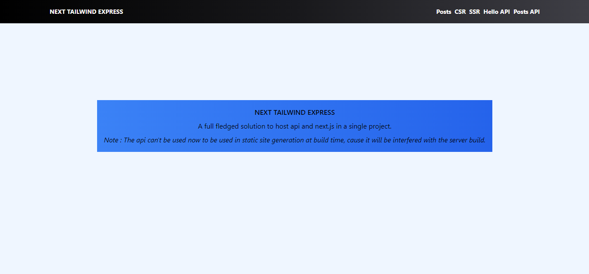
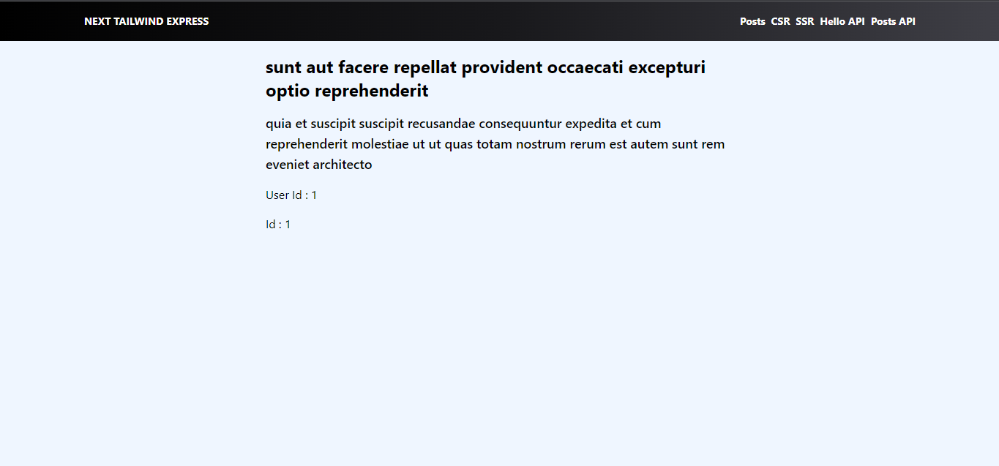
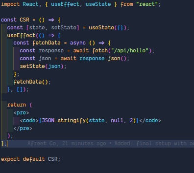
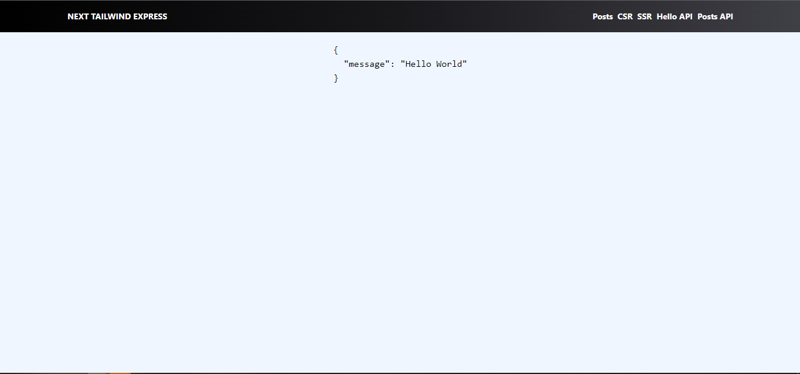
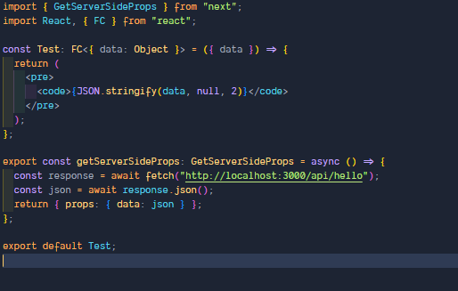
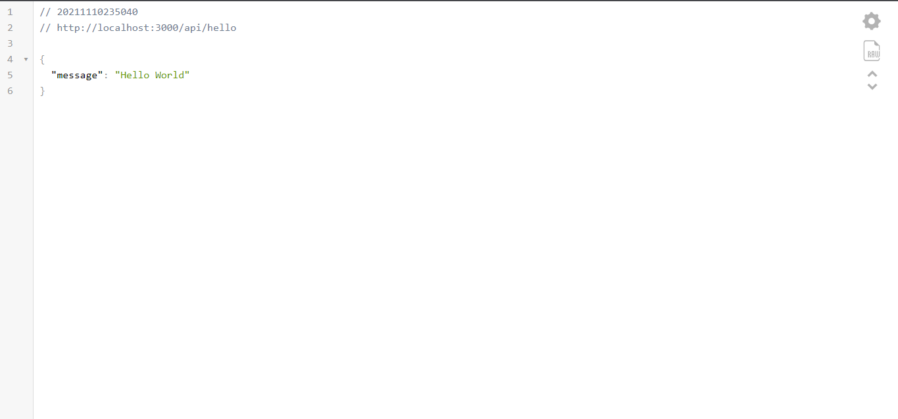
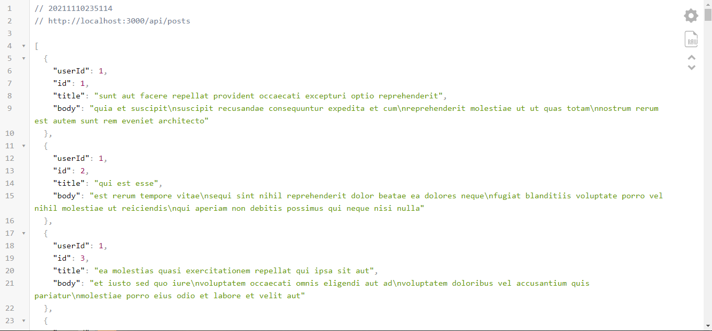

# Next Tailwind Express

A full fledged solution to host api and next.js in a single project.

- Homepage
  
- Static Posts
  
- Static Post
  
- CSR
  
- CSR Code
  
- SSR
  
- SSR Code
  
- Hello API
  
- Posts API
  
